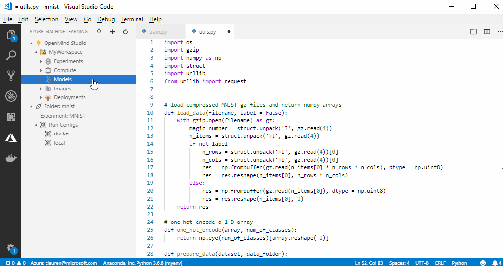
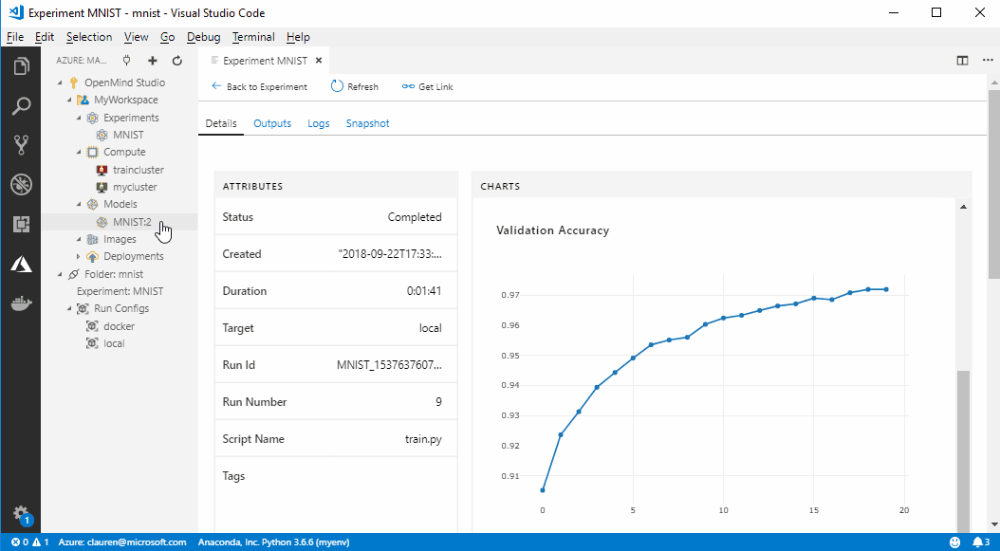

# Deploy and manage models with Azure Machine Learning
Azure Machine Learning enables deploying and managing your machine learning models in the cloud and on the edge. 

## Register your model to Azure Machine Learning

Once your model is trained you can register it with Azure Machine Learning to track it and deploy.
1. Open the Azure Machine Learning view in the Azure activity bar
2. Expand your Azure subscription and Azure Machine Learning workspace
3. Right-click Models in the tree control and click Register Model
4. Select either to upload a single model from a **model file** or if you have a model with multiple files (like a Tensorflow model often does) then select **model folder**
5. Use the file picker to select your file or path

> **Note**: For now, please remove the Tags from the generated json file

## Deploy your service

You can deploy your service to either an Azure Container Instance to test or select an Azure Kubernetes Service. Learn how to create Azure Kubernetes Service in [Create and manage compute targets in Visual Studio Code](manage-compute-aml-vscode.md)

You do not need to create an Azure Container Instance to test in advance, this will be created automatically.

- You can deploy a service from a registered model by right the "Models" node and select the model to be deployed
- Right click the model to be deployed, select "Deploy Service from Registered Model" command from the context menu;
- Select the service type in the Command Palette.
- Input the service name.
- A dialog box will pop-up in the lower right corner, click "**Browse**" button then select your scoring script
- **Optional**: Click "Browse" button and select the local docker file (otherwise will use Azure Machine Learning default)
- A dialog box will pop-up in the lower right corner, click "Browse" button then select the local conda file path, or input the file path in json editor later;
- **Optional**: Click "Browse" button and select a schema.json file

**Example for Azure Container Instance**

> **Note**: For now, please remove the Tags from the generated json file

## Congratulations!
You have successfully prepared Visual Studio Code for use with Azure Machine Learning. 

- To learn more about how to get started with Azure Machine Learning in Visual Studio Code, see [Getting started with Azure Machine Learning](/docs/getting-started-aml-vscode.md)
- To learn how to create and use Azure Virtual Machines, Azure Batch AI clusters and Azure Kubernetes clusters from Visual Studio Code to train and deploy your models, see [Create and manage compute targets in Visual Studio Code](manage-compute-aml-vscode.md)
- To learn how to train models and manage your experiments from Visual Studio Code, see [Training models and managing experiments in Visual Studio Code](train-models-aml-vscode.md)
- To learn how to deploy and manage models from Visual Studio Code, see [Deploying and managing models in Visual Studio Code](deploy-models-aml-vscode.md)
