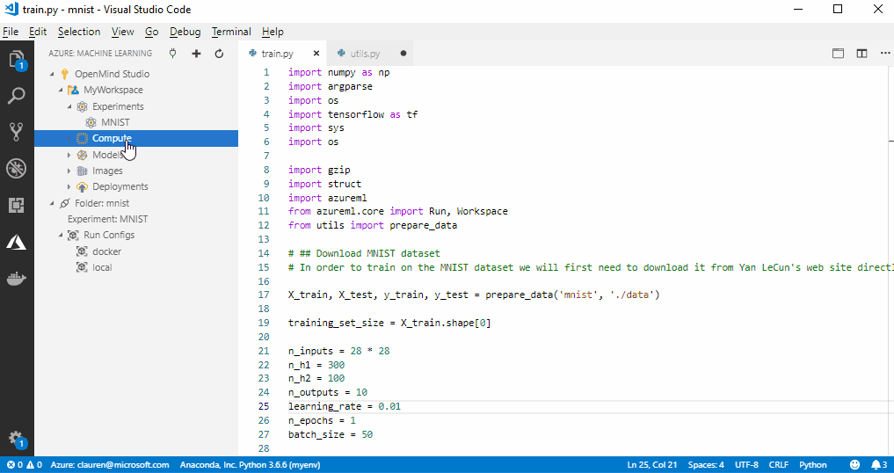

# Create and manage Azure compute targets in Visual Studio Code
Visual Studio Code Tools for AI supports running data preparation and model training experiments both locally and on remote compute targets.

This extension supports creating and using 4 different types of remote compute targets with Azure Machine Learning:

**Types of Managed Compute**

| Resource | Description |
| --- | --- |
| `Azure Virtual Machines`  | Train models on powerful virtual machines with more memory, faster CPU or the latest GPU for deep learning |
| `Azure Batch AI cluster` | Automatically scale up or tear down a cluster of powerful GPU machines. When you're not running any experiments, this cluster can even shrink to 0 virtual machines so you're only paying for the compute you use |
| `Azure Kubernetes Service` | Deploy models in docker containers on a scalable, managed Kubernetes cluster |
| `Azure Container Instance` | On demand hosting for docker containers. Used for test purposes only, production workloads should be run in Azure Kubernetes Service |

## Create managed compute

To create each of the different types of managed compute you will follow the same steps, but each type has a few different options
1. Open the Azure Machine Learning view in the Azure activity bar
2. Expand your Azure subscription and Azure Machine Learning workspace
3. Right-click Compute in the tree control and click Create Compute
4. Select the type of compute (Azure Batch AI, Azure Kubernetes Service, Azure Virtual Machine)
5. Type the name and select the Virtual Machine size
6. Specify any advanced properties in the json config file provided at the end of the wizard
7. Click finish in the notification the lower right

**Example for Azure Batch AI**


## To use remote compute for experiments
You must first create a run configuration file. This tells Azure Machine Learning not only where to run your experiment but also how to prepare the environment.

The VS Code extension will automatically create a run configuration for your **local** and **docker** environments on your local computer.
- By default,  Azure Machine Learning will create a new conda environment for you and manage all of your installation dependencies. You must specify your dependencies in the `aml_config/conda_dependencies.yml` file
- If you want to install all of your libraries/dependencies yourself, set `userManagedDependencies: True` and then local experiment runs will use your default Python environment as specified by the VS Code Python extension.

**Section of default generated run configuration**

```yaml
# user_managed_dependencies=True indicates that the environment will be user managed. False indicates that AzureML will manage the user environment.
    userManagedDependencies: False
# The python interpreter path
    interpreterPath: python
# Path to the conda dependencies file to use for this run. If a project
# contains multiple programs with different sets of dependencies, it may be
# convenient to manage those environments with separate files.
    condaDependenciesFile: aml_config/conda_dependencies.yml
# Docker details
    docker:
# Set True to perform this run inside a Docker container.
    enabled: false
```

**Section of default generated aml_config/conda_dependencies.yml**

Add additional dependencies in the config file

```yaml
# The dependencies defined in this file will be automatically provisioned for runs with userManagedDependencies=False.

name: project_environment
dependencies:
  # The python interpreter version.

  # Currently Azure ML only supports 3.5.2 and later.

- python=3.6.2

- pip:
    # Required packages for AzureML execution, history, and data preparation.

  - --index-url https://azuremlsdktestpypi.azureedge.net/sdk-release/Preview/E7501C02541B433786111FE8E140CAA1
  - --extra-index-url https://pypi.python.org/simple
  - azureml-defaults

```

## Congratulations!
You have successfully prepared Visual Studio Code for use with Azure Machine Learning. 

- To learn more about how to get started with Azure Machine Learning in Visual Studio Code, see [Getting started with Azure Machine Learning](/docs/getting-started-aml-vscode.md)
- To learn how to train models and manage your experiments from Visual Studio Code , see [Training models and managing experiments in Visual Studio Code](train-models-aml-vscode.md)
- To learn how to deploy and manage models from Visual Studio Code , see [Deploying and managing models in Visual Studio Code](deploy-models-aml-vscode.md)
